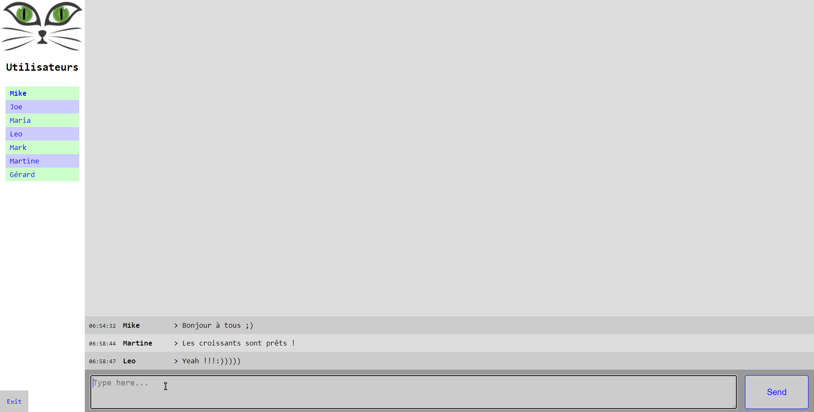

# TP ASP.NET : Mini Chat

Création d'une petite application de messagerie instantannée.

Les utilisateurs (id,username,password) se connectent et peuvent discuter dans un salon dédié.

## Fonctionnalités

- **Salon de discussion principal** 
  - tous les messages sont enregistrés (ip, utilisateur, message) et conservés dans une base de données

- **Utilisateurs**
  - inscription simple
  - connexion

## Interface principale

## Fonctionnalités Bonus (v2)

Les utilisateurs possèdent un rôle (administrateur, modérateur, utilisateur).

Les utilisateurs peuvent modifier leur propre mot de passe.

Les administrateurs peuvent gérer les utilisateurs (lister, ajouter, éditer, supprimer).

Les modérateurs peuvent supprimer des messages dans les salons publics.

## Fonctionnalités Bonus (v3)

Les utilisateurs peuvent créer des salons de discussion publics ou privés et inviter d'autres utilisateurs connectés à y participer.

Les utilisateurs peuvent voir et rejoindre les salons publics.

Les utilisateurs peuvent accepter ou refuser une invitation et peuvent quitter un salon à tout moment.

Les utilisateurs participant à un salon de discussion rejoignent automatiquement ce salon lorsqu'ils se reconnectent à l'application.

Un salon est détruit lorsque tous les utilisateurs l'ont explicitement quitté.