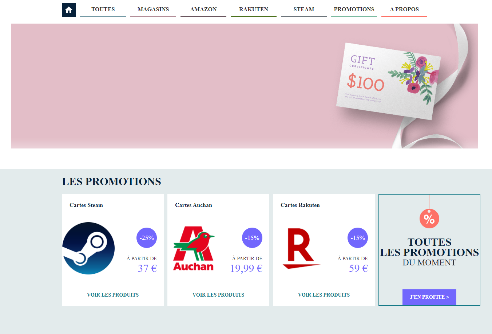

# TP ASP.NET : Mini Boutique

Création d'une petite boutique en ligne de cartes cadeaux.

Les administrateurs (id,username,password) peut gérer les articles.
Les utilisateurs peuvent ajouter des articles de la boutique dans un panier d'achat et valider leur commande.

## Fonctionnalités

- **Gestion des cartes** 
  - Magasins : (store_id,store_name,store_description)
  - Cartes cadeaux (id,name,amount,expiration_date,available_quantity,discount_percent, #store_id)

- **Utilisateurs**
  - Non enregistrés : 
    - Parcourir les cartes cadeaux
    - Ajouter des cartes cadeaux dans un panier d'achat
    - Valider la commande (paiement simulé)
  - Enregistrés (administrateurs) : 
    - Gérer la boutique (ajouter, modifier, supprimer des cartes cadeaux)

## Interface principale

Exemple de l'interface attendu (page des promotions)

## Fonctionnalités Bonus (v2)

Les cartes sont associées à une ou plusieurs catégories (magasin physique, virtuel, offre spéciale...).

Les vues associées aux catégories sont disponibles.

## Fonctionnalités Bonus (v3)

Les clients peuvent s'enregistrer en renseigner leur adresse (il faudra alors différencier les clients et les administrateurs).

Les paniers d'achat et les commandes sont désormais obligatoirement associés à un compte client.
